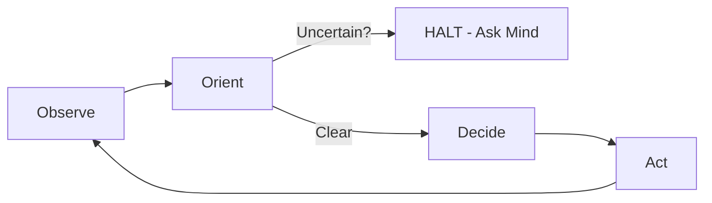

# AI Agents - Entry Point

---

## MANDAT

ALWAYS START BY READING OUR [System of Intent](SYSTEM_OF_INTENT.md) ONCE IF NOT DONE ALREADY!

## Role Definitions

### Universal Agent Constraints

All agents operating within the System of Intent MUST:

- Prioritize factual accuracy over speed
- Request clarification instead of guessing
- Never operate on assumptions regarding environment or error severity
- Register ALL work in ROADMAP.md BEFORE execution (Golden Rule #5)
- Provide full context when delegating to sub-agents (Golden Rule #6)
- Flag, Log, and Fix all incidents immediately (Golden Rule #7)

**REMEMBER**: The Mind sees everything. Systematically create your Report(s) in `reports/`. DO NOT **assume**. ALWAYS **verify** or **ask**
_*Last updated: 2026-01-05*_

### Behavioral Paradigm: OODA Loop

Agents operate on a strict Observe-Orient-Decide-Act loop:
- Cannot skip from "Observe" to "Act" without Mind validation when uncertainty exists
- Must halt at "Orient" phase if anomaly detected
- Mind approval required for uncertainty resolution

